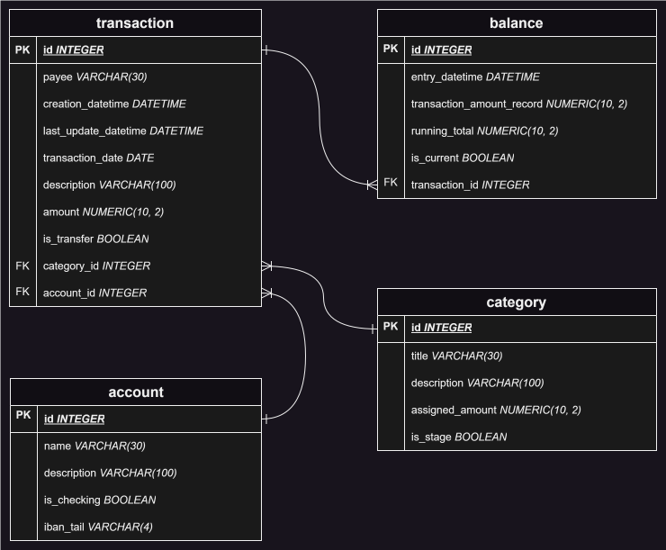

# DIYB
#### Do It Yourself Budget

REST API project with the aim keeping a budget. Keep track of your monthly expenses and categorize your cash. Heavily inspired by [YNAB](http://www.ynab.com)

--------
This project is built with the following technologies:
+ Python 3.11
+ FastAPI
+ sqlite3
+ SQLAlchemy 2.0

----
### Entity Relation Diagram
